import { Head, Image, Appear, Code } from 'mdx-deck'
export { default as theme } from './theme'

import { CodeSurfer } from "mdx-deck-code-surfer"
import {VERTICAL_SCALE, HORIZONTAL_SCALE} from 'components/MarginScale'

import MainThreadAnimation from 'components/MainThreadAnimation'
import WorkerThreadAnimation from 'components/WorkerThreadAnimation'
import ScrollDetection from 'components/ScrollDetection'
import IntersectionObserverScrollDetection from 'components/IntersectionObserver'
import Ben from 'components/Ben'

import RelativeLayout from 'components/RelativeLayout'
import KeyPointLayout from 'components/KeyPointLayout'
import LandingLayout from 'components/LandingLayout'

import TextAlign from 'components/TextAlign'
import StrikeThrough from 'components/StrikeThrough'
import Topic from 'components/Topic'
import Impact from 'components/Impact'
import {PrimaryButton, SecondaryButton} from 'components/Button'

<Head>
  <title>Fast by default: Rebuilding Algolia's website</title>
  <link rel="stylesheet" href="./styles.css"></link>
  <link href="https://fonts.googleapis.com/css?family=Hind" rel="stylesheet"></link>
  <link href="https://fonts.googleapis.com/css?family=Poppins:700" rel="stylesheet"></link>
</Head>

export default LandingLayout

<h3 class="subtitle">Rebuilding Algolia's website</h3>
<h1>Fast by default</h1>
<h4>welovespeed conference</h4>

<div class="info">
  <p>Jonas Badalic</p>
  <p>jonas@algolia.com</p>
</div>

---
export default RelativeLayout

## Performance is important to us ⚡️
- crazy fast search engine
- near real time analytics
- big advocates of performance

```notes
- speed = good ux + revenue
- inside the engine series
```
---
export default RelativeLayout

## Fast search = good UX
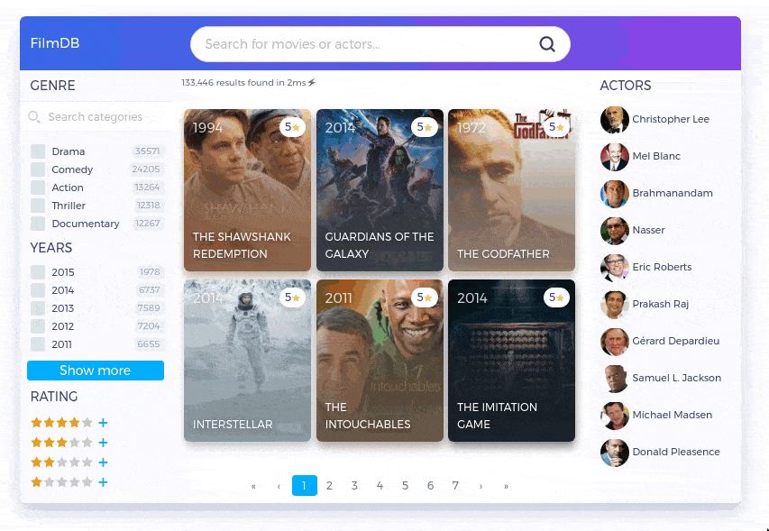
---
export default RelativeLayout

## Ugh, what?

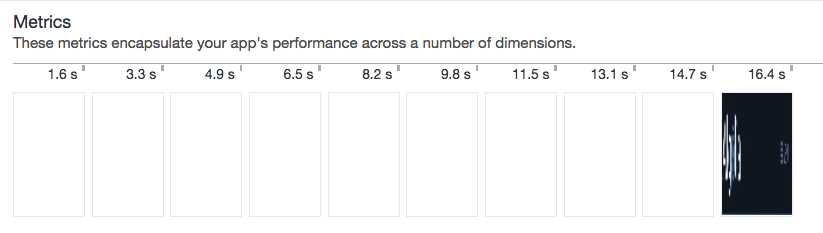
---
export default RelativeLayout

🤨
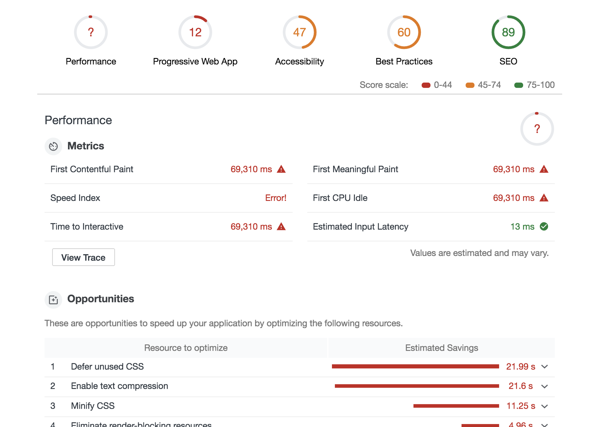
---
export default KeyPointLayout

# How we went from
16seconds to sub second load times on 3G

```notes
- every engineering story has at least one
- mostly fixing, but also FINDING issues
- and leave things in a better state than they were
```
---
export default RelativeLayout

## Talk overview

<TextAlign align="left">
  <ul>
    <li>Handling assets</li>
    <li>Compression</li>
    <li>Network optimizations</li>
    <li>Hidden bottlenecks and bad practices</li>
    <li>Runtime optimizations</li>
  </ul>
</TextAlign>

```notes
- by the end of the talk, you have a strong understanding of the ecosystem and tools
```
---
export default RelativeLayout

## Kind of like cleaning a car

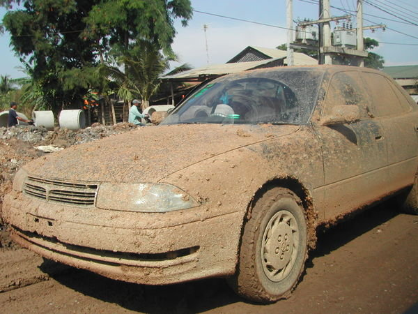

```notes
- you won't go polish the wheels first
- quick wins to do the best job
- digging deeper
- toothbrush to polish the part that nobody will ever see
```
---
export default RelativeLayout

## The tools

<div style={{
  marginTop: VERTICAL_SCALE["2"],
  display: "flex",
  width: "62vw",
  justifyContent: "space-between"
}}>
  <div>
    
    <p>Chrome lighthouse</p>
  </div>
  <div>
    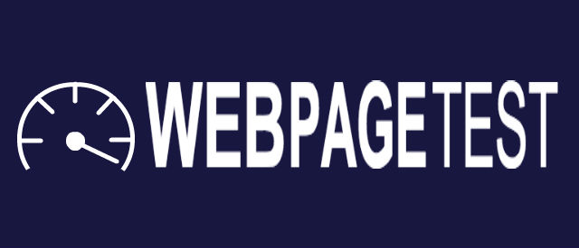
    <p>webpagetest</p>
  </div>
</div>
---
export default KeyPointLayout

# Asset size audit

```notes
- check where the size comes from
- clean unused modules
```
---
export default RelativeLayout

## Almost the same


```notes
- one of them is a NodeList, so you can forEach in some browsers, not all
- and yes, I'm talking about InternetExplorer
```
---
export default RelativeLayout

## About 30KB difference!

<TextAlign align="left">
  + Saving parse and eval time 💪
</TextAlign>

```notes
- No bit is faster than the one not sent
```
---
export default RelativeLayout

## Saving 70ms of script evaluation time
---
export default RelativeLayout

## Before: 93ms
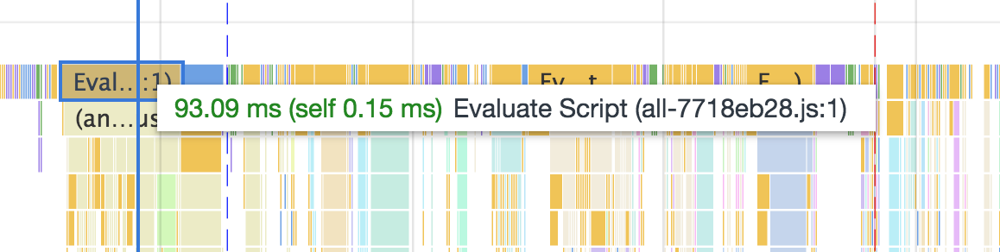
---
export default RelativeLayout

<h2>After: <strike>93ms</strike>  <b>23ms</b></h2>

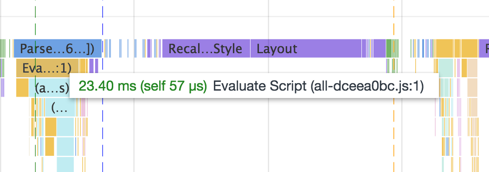

```notes
- a lot less noise, less instantiation and smaller memory footprint
```
---
export default RelativeLayout

<h2>So we did something for JS,<br/> what about CSS?</h2>
---
export default RelativeLayout

<CodeSurfer
  title="Example: "
  code={require("!raw-loader!./snippets/non-atomic.html")}
  lang="html"
  showNumbers={true}
  dark={false}
  steps={[
    { range: [1, 3] },
    { range: [4, 6] },
    { range: [8, 11] },
  ]}
/>

```notes
- Using middleman to build
- no optimization
- no CSS in JS
```
---
export default RelativeLayout

<CodeSurfer
  title="Atomic CSS:"
  code={require("!raw-loader!./snippets/atomic.html")}
  lang="html"
  showNumbers={true}
  dark={false}
  steps={[
    { range: [1, 3] },
    { range: [4, 6] },
    { range: [8, 11] }
  ]}
/>

```notes
- No bit is faster than the one not sent
```
---
export default RelativeLayout

# About 30 bytes difference...
<TextAlign align="left">
  * Multiplied by the number of occurences 💰
</TextAlign>
---
export default KeyPointLayout

# Images
---
export default RelativeLayout

## The problem:
<div style={{position: 'relative', width: 500, height: 500, marginTop: VERTICAL_SCALE[2]}} >
  
  
</div>
---
export default KeyPointLayout

<h2>If you often find yourself resizing images, you are probably not using the right sizes.</h2>
---
export default RelativeLayout

<Ben/>
---
export default KeyPointLayout

## WebP you say?
<small>How?</small>
---
export default RelativeLayout

## Enabling WebP on your server

- transparent image manipulation
- nothing to implement in the client
- proper feature detection via accept: image/webp
---
export default RelativeLayout

## Or going the 2018 way
<div style={{marginTop: VERTICAL_SCALE[2]}}>
  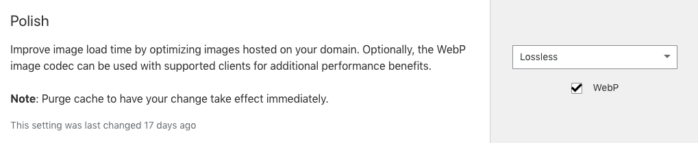
</div>
---
export default RelativeLayout

## but WebP can be weird

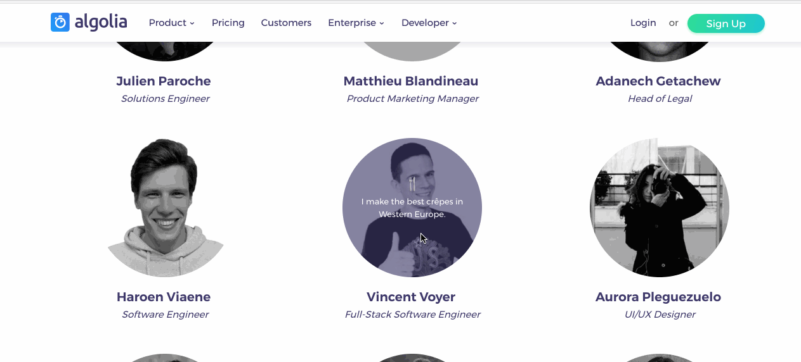

```notes
- Don't use it for assets that people need to download
- Brand assets, logos...
```
---
export default KeyPointLayout

## A step further with Brotli 🥦
---
export default RelativeLayout

## Brotli compression
<div style={{marginTop: VERTICAL_SCALE[2]}}>
<ul>
  <TextAlign>
    <li>Smaller compression</li>
    <li>Not really supported everywhere</li>
    <li>Accept-Encoding: “br”</li>
    <li>Can be quite hard to setup</li>
    <li>Default compression level -11</li>
  </TextAlign>
</ul>
</div>
---
export default RelativeLayout

## Example: index.html


```notes
- Brotli -6 vs Gzip -9
- A lot of articles of brotli being slower
```
---
export default RelativeLayout

## Add brotli module to nginx, apache or 

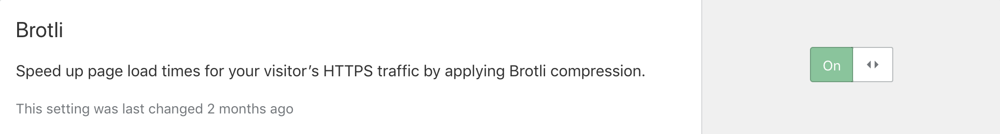
---
export default RelativeLayout

## Chrome coverage tool
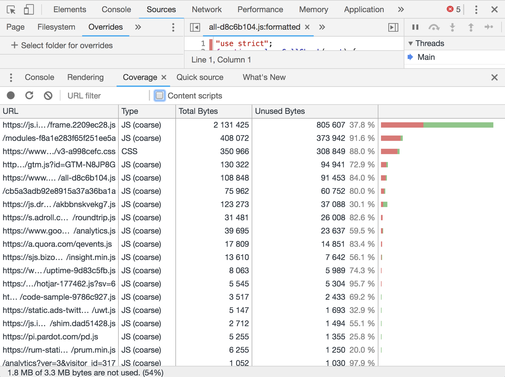

```notes
- No bit is faster than the one not sent
```
---
export default KeyPointLayout

# Just because something is small, doesn’t mean it’s actually used at all.

---
export default RelativeLayout

## Marketing/Tracking scripts
---
export default RelativeLayout

<Image src="assets/marketing-scripts.gif" width="60vw" height="60vh" />

```notes
- No bit is faster than the one not sent
```
---
export default RelativeLayout

## Nobody wants this
<div style={{marginTop: VERTICAL_SCALE[2]}}>
  <TextAlign align="center">
    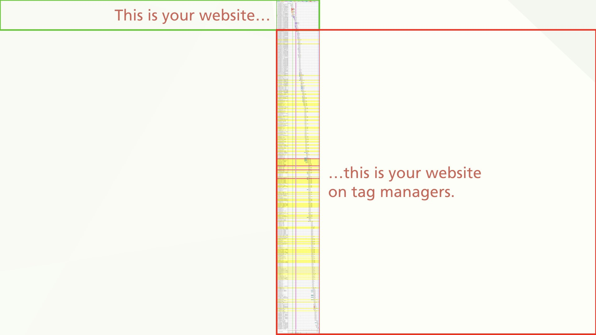
  </TextAlign>
</div>
---
export default RelativeLayout

## You will have to fight it!

- Explain the negative impacts on the site
- Try to ask if anyone even uses them?

```notes
- requests, different origins, bloating the page
- if nobody uses it, safe to remove
```
---
export default RelativeLayout

## A trick to rule them all 
---
export default RelativeLayout

## GDPR


```notes
- sometimes tools like hotjar etc might be recording user identifiable information, in which case they are a "data processor"
```
---
export default KeyPointLayout

# Total savings
## 1MB to ~200KB
---
export default KeyPointLayout

<h2>Payload size is only<br/>a part of the equasion</h2>

---
export default RelativeLayout

## Faking "speed"

<div style={{
  marginTop: VERTICAL_SCALE["2"],
  display: "flex",
  width: "90vw",
  alignItems: "center",
  justifyContent: "space-between"
}}>
  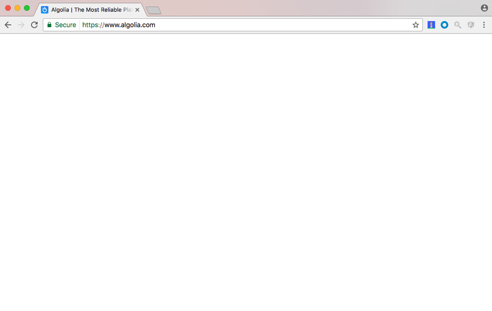
  <div  style={{margin: `0 ${HORIZONTAL_SCALE[1]}`, whiteSpace: 'nowrap'}}>⬅️ 3 seconds ➡️</div>
  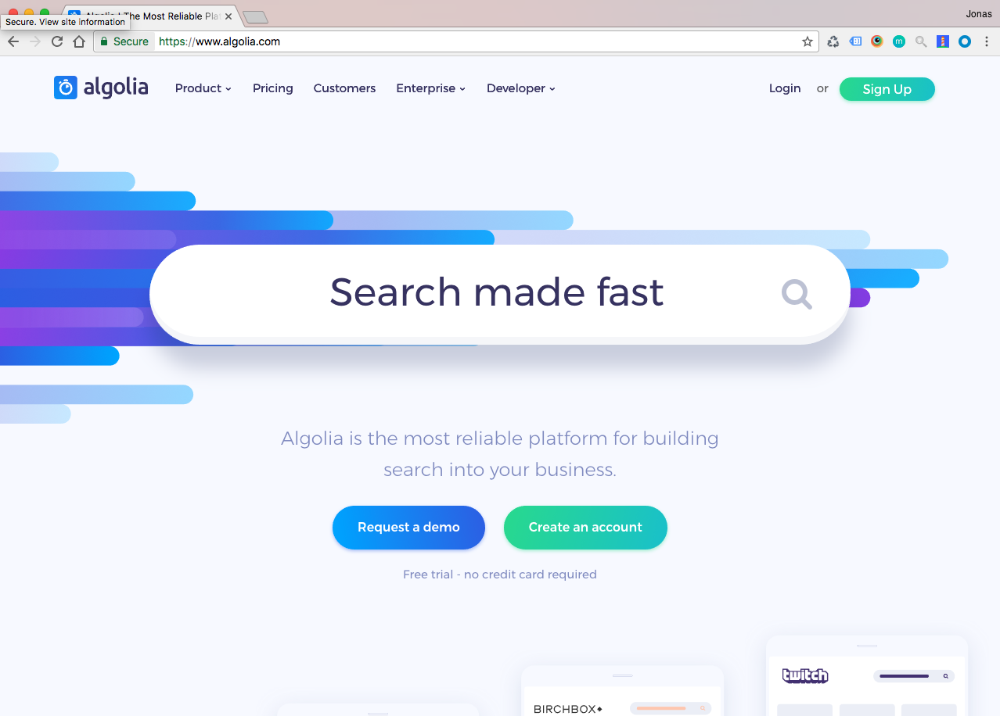
</div>

```notes
- humans are naive
- improving TTFP
- removing blocking assets
```
---
export default RelativeLayout

## Same load time, faster TTFP

<div style={{
  marginTop: VERTICAL_SCALE["2"],
  display: "flex",
  width: "92vw",
  alignItems: "center",
  justifyContent: "space-between"
}}>
  
  <small  style={{margin: `0 ${HORIZONTAL_SCALE[1]}`, whiteSpace: 'nowrap', fontSize: 16}}>⬅️ 1 second ➡️</small>
  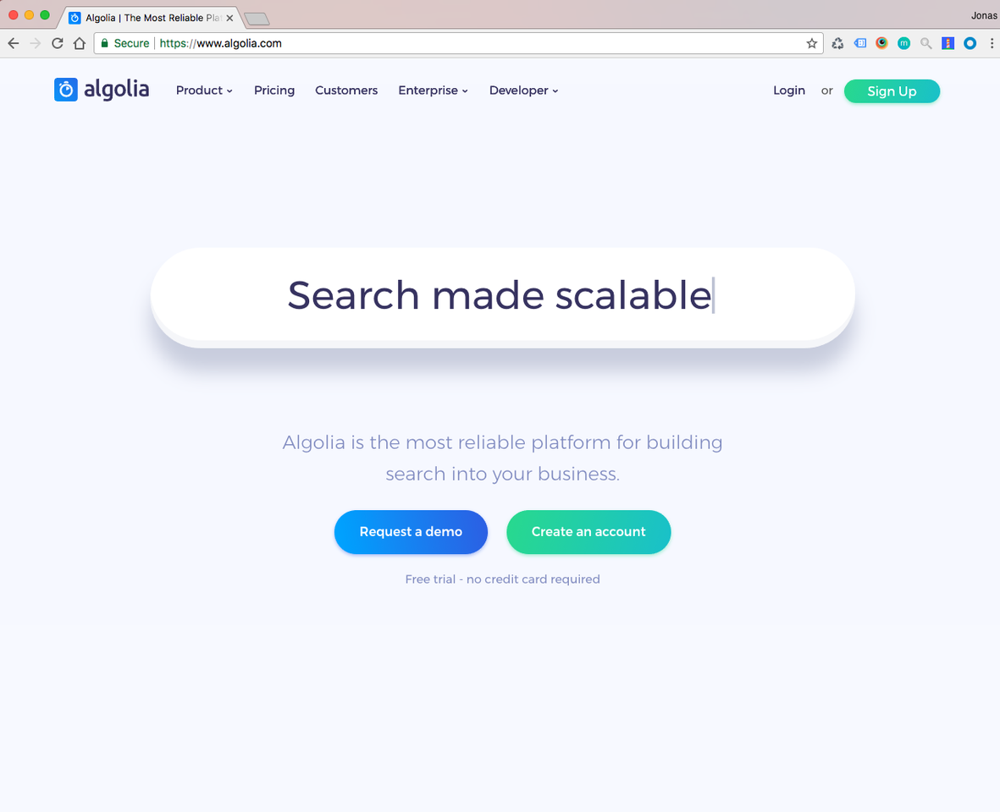
  <small  style={{margin: `0 ${HORIZONTAL_SCALE[1]}`, whiteSpace: 'nowrap', fontSize: 16}}>⬅️ 3 seconds ➡️</small>
  
</div>

```notes
- 5x decrease, faster delivery
- faster TTFP
```
---
export default RelativeLayout

<TextAlign>
  <div>Interviewer: What's the <b>fastest</b> you went on a bike?</div>
  <div>Kid:         <b>30</b></div>
  <div>Interviewer: <b>30 what?</b></div>
  <div>Kid: <small><i>*long pause*</i></small></div>
</TextAlign>
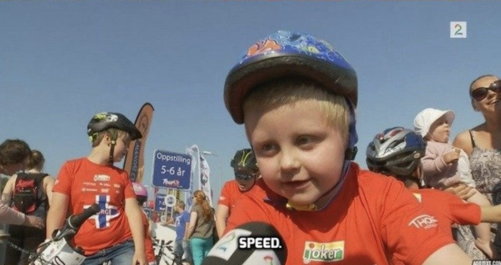

```notes
- the feeling of going fast
- is not the same as going fast
- users don't care how fast we are going
```
---
export default RelativeLayout

## How?
---
export default RelativeLayout

## Optimizing delivery and render time

- Using a good CDN
- Reducing the amount of critical requests
- Prioritize critical assets
- Resource hinting and lazy loading
- If it's not critical, it shouldn't block render!
- Caching!

```notes
- CDNs
- Network optimizations
- HTTP/2/push
```
---
export default RelativeLayout

## Before: 4 resources, 3 different domains

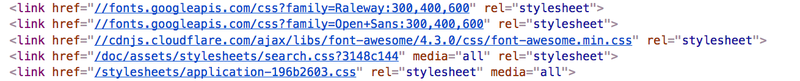
---
export default RelativeLayout

## After: single resource

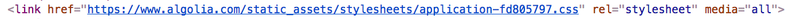
---
export default RelativeLayout

## The price of TLS

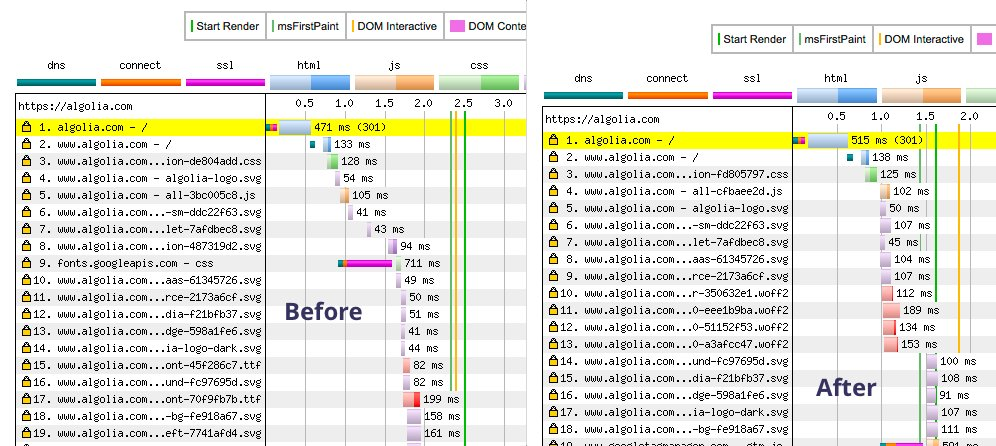
---
export default RelativeLayout

## 0 RTT with TLS 1.3

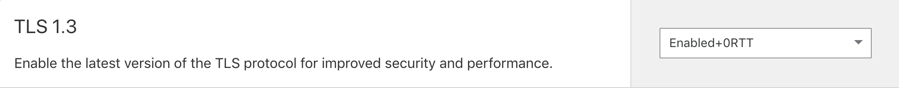

```notes
- 0 rtt time at a cost of security
- vulnerable to replay attacks
```
---
export default RelativeLayout

## HTTP/2
- Multiplexing connections
- Header compression
- Push

```notes
- HTTP/2
- Resource hinting
- Font loading strategies
- Image loading strategies
- 1st two not controllable
- But we can control push
```
---
export default RelativeLayout

## HTTP/2 Push


<div>
  <small style={{fontSize: 14}}>src: https://blog.golang.org/h2push</small>
</div>

```notes
- much harder than it seems
- client cache
- pushing resources
- async streams
- improper implementations will cause congestions
```
---
export default RelativeLayout

## But what do we push? 🤔

<small>*not you javascript*</small>
---
export default RelativeLayout

## Do not push

- large files
- javascript
- images

```notes
- those are not render blocking
- let the browsers prioritize
```
---
export default RelativeLayout

## Do push

- critical CSS
- and in certain cases some fonts
---
export default RelativeLayout

## But what if...
- Client has already cached the files
- Which files and how does the server know?
---
export default RelativeLayout

## Imperfect implementation leads to
- Wasted bandwidth, time and resources 🗑
- Negative impact on page loading ❗️

```notes
- much harder than it seems
- client cache
- pushing resources
- async streams
- improper implementations will cause congestions
```
---
export default RelativeLayout

## A smarter HTTP/2 Push with 🍪

```notes
- track user session and assume that the contents are cached based on a cookie
- but do you really want to do that by yourself??
```
---
export default RelativeLayout

## New frame type

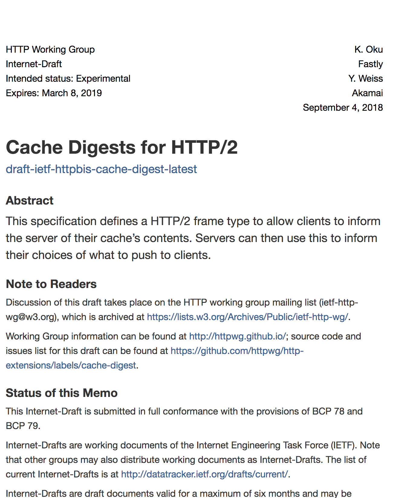

```notes
- indicate cached content, then decide what to do on the server
```
---
export default RelativeLayout

## Saved ~200ms when loading CSS

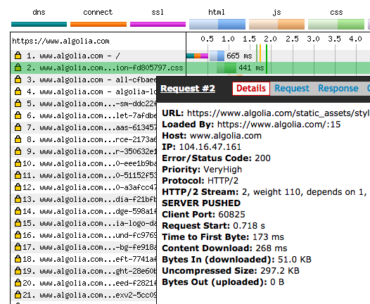
---
export default RelativeLayout

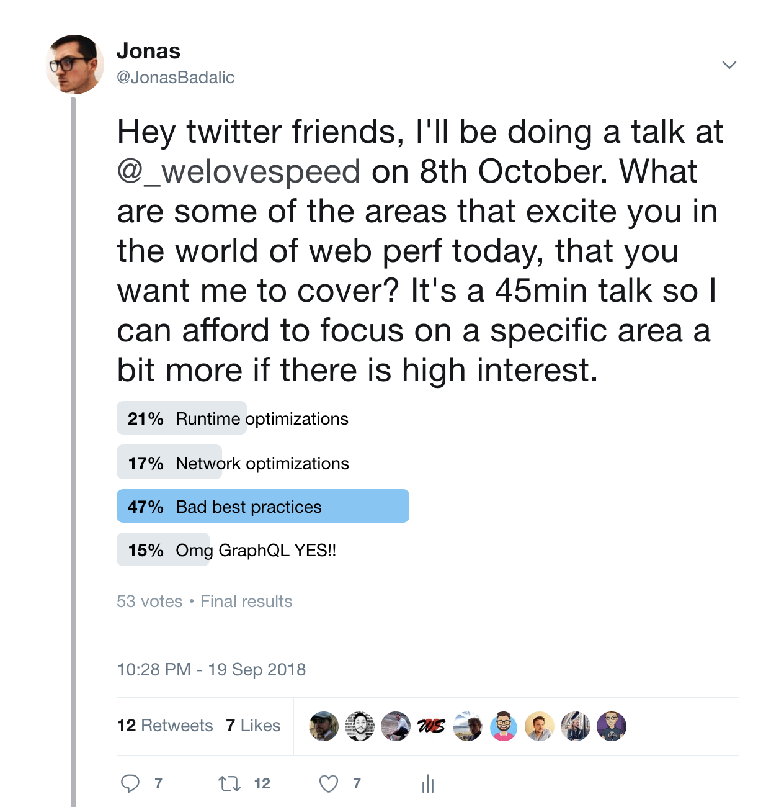
---
export default KeyPointLayout

## Bad best practices
---
export default RelativeLayout

## Saving requests
---
export default RelativeLayout

## No impact with HTTP/2
<div style={{textAlign: 'left'}}>

Split your code

Load what you need

Use bundlers
</div>

```notes
- no longer a strong impact with htt2p
- might save some battery life
- mostly useless
- bundlers: tree shaking + code splitting
```
---
export default KeyPointLayout

## Base64 encoding
---
export default RelativeLayout

<div style={{display: 'flex', alignItems: 'center', justifyContent: 'center'}}>
  <h2>Generates larger files</h2>
  
</div>


```notes
- gzip won't save you
```
---
export default RelativeLayout

<CodeSurfer
  title="But this is why it's really bad!"
  code={require("!raw-loader!./snippets/base64.css")}
  lang="css"
  showNumbers={true}
  dark={false}
  steps={[
    { range: [1, 3] },
    { range: [4, 6] },
  ]}
/>

```notes
- images are not render blocking by default
- base64 => blocking
- caching
- how do you cache the image inside the stylesheet?
- lost cache control over the image
```
---
export default RelativeLayout

## Why?
- Images are not render blocking, encoded images are
- You **loose all** cache control
- How do you optimize if the client supports WebP?
---
export default RelativeLayout

## Common Base64 encoding occurences
- (Icon) Fonts
- Images
---
export default KeyPointLayout

## The problem of inlining SVG's

```notes
- very similar tradeoff as base64
- loosing cache control
- bloating HTML size
```
---
export default RelativeLayout

## 74KB index.html 😱
<div style={{marginTop: VERTICAL_SCALE[2]}}>
  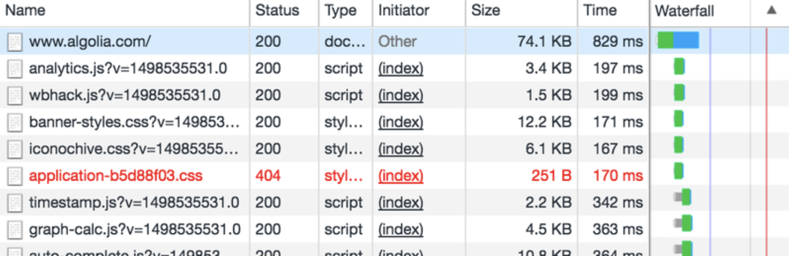
</div>
---
export default RelativeLayout

## 16KB index.html 😎
<div style={{marginTop: VERTICAL_SCALE[2]}}>
  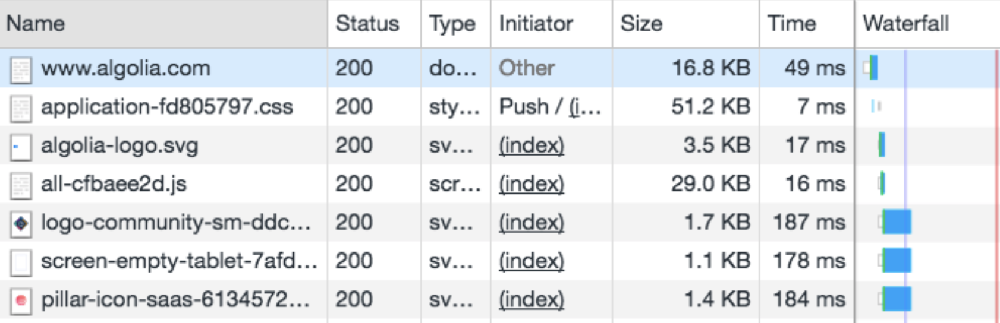
</div>
---
export default RelativeLayout

## Runtime optimizations
---
export default RelativeLayout

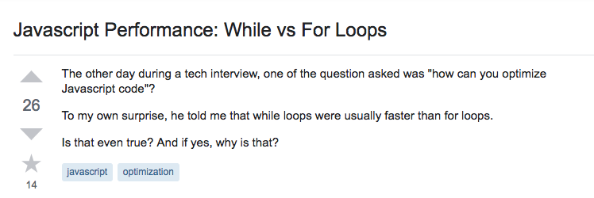
---
export default KeyPointLayout

## It probably doesn't matter
<small>because there's much larger wins you can do first!</small>

```notes
- let's look at animations
```
---
export default RelativeLayout

## Did you know you can animate from a separate thread?
---
export default RelativeLayout

## Demo time - main thread
<MainThreadAnimation/>
---
export default RelativeLayout

## Demo time - worker thread
<WorkerThreadAnimation/>
---
export default RelativeLayout

## What about scroll detection?
---
export default RelativeLayout

<ScrollDetection />webp
---
export default RelativeLayout

<IntersectionObserverScrollDetection />
---
export default RelativeLayout

<CodeSurfer
  title="The API is clean"
  code={require("!raw-loader!./snippets/IntersectionObserver.js")}
  lang="css"
  showNumbers={true}
  dark={false}
  steps={[
    { range: [1, 14] },
    { range: [16, 23] },
  ]}
/>
---
export default RelativeLayout

## New Observer API's

- IntersectionObserver
- ResizeObserver
- PerformanceObserver
- MutationObserver
---
export default RelativeLayout

## The goal is
- Keep the main thread idle 🤫
- Use the native API without workarounds 🌬
- Improve runtime performance 🤩
---
export default RelativeLayout

## Great, what now?
---
export default KeyPointLayout

## Monitoring!

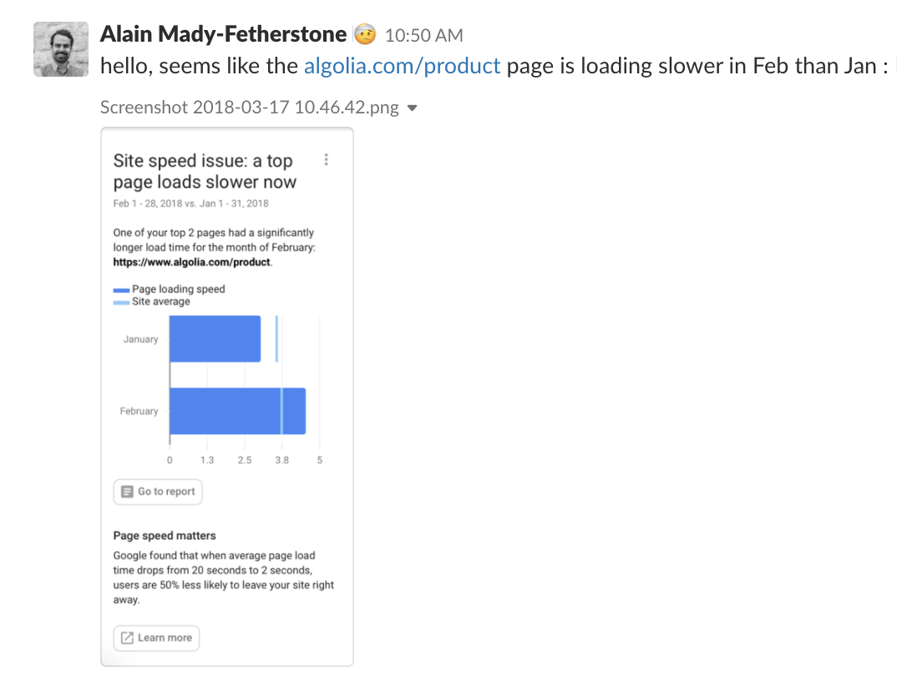
---
export default RelativeLayout

## What was the impact on our users?
---
export default RelativeLayout

## Impact on our users

- <b>~50% users TTI in 1 second, compared to 15sec</b>
- <b>1-3 seconds max loading time</b>
- <b>a big drop in bounce rate</b>
---
export default RelativeLayout

## Monitoring regression:

- Sub-site you don't control
- Some sort of CMS integration
---
export default RelativeLayout

## A story about a 5MB couch


```notes
- monitoring pages
- notice a 5MB asset being loaded
- tl;dr it's a couch
```
---
export default RelativeLayout

## Multiple options

- 3rd party services
- Puppeteer

---
export default RelativeLayout

<CodeSurfer
  title="Example: quick load time test"
  code={require("!raw-loader!./snippets/puppeteer_loading.js")}
  lang="js"
  showNumbers={true}
  dark={false}
  steps={[
    { range: [3, 3] },
    { range: [5, 9] },
    { range: [10, 10] },
  ]}
/>
---
export default KeyPointLayout

# Thank you!
---
export default RelativeLayout

<https://github.com/JonasBa/welovespeed>
